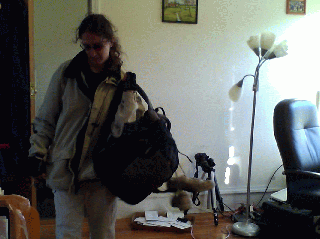
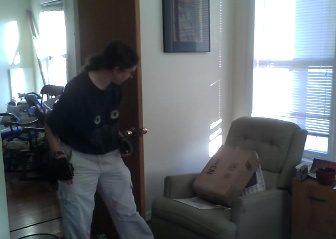
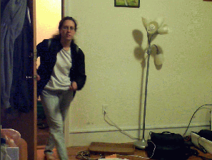
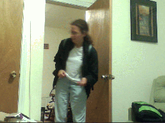

Dumb Machine Vision Prank
=========================

A few weeks ago, my wife came home from sailing:

She heard me call out &quot;Hey Stefie, how was sailing?&quot; and she looked
around the apartment for a few minutes to find me:

But I wasn't home, so she eventually went back to work, and never said
anything more about it. A couple weeks later, she came home from work:

She, again, heard me ask from my room &quot;Hey Stefie, how are you? How was your
meeting at work,&quot; but I was nowhere to be found:

After I came home, she initially didn't say anything about it, but
eventually asked if I had rigged up the computer to greet her when she
came home. I couldn't deny it ;)

How I did it: 

`april.py` is the main machine vision script. It
has two rectangles -- one corresponding to the door, and one
corresponding to everything else. It will trigger if there is more
than some amount of motion at the door, and less than some amount of
motion everywhere else. The second rectangle is there so the script
won't react to e.g. lighting changes. I don't know if the second
rectangle is required, but I do know that I had zero false positives
or negatives with this algorithm over a fairly long period of time. To
use this script, there are a few things to modify:

* `rect1` and `rect2` define the region of the door, and the region of
  not-the-door. `test_run` and `skip_diff` should be set to `true` to
  allow you to visualize where these regions are. They should both be
  `false` otherwise.
* `a` and `b` in the main loop are measures of motion in both
  regions. The thresholds may need to be changed (in my case, I used 0.2
  and 0.1). There was a very large range where there were no false
  positives or negatives.

`dothat.sh` runs on the machine in my living room. It runs the machine
vision program, waits 2 seconds from the event (to allow my wife to
come in), begins video recording, and then notifies the other machines
(the IP here needs to be changed).

`doit.sh` runs on the machine in my bedroom. It plays the greeting,
and then record video of my wife looking for me.

The `gst-launch` command is a beast. All it does is record video for
half an hour (so I had proof). You'll need to mess with it to get the
right audio/video device, and on some machines, you may need to
disable audio. See the examples in the scripts. I had help with this
one from the gstreamer IRC channel.

All of this runs under Ubuntu GNU/Linux, and isn't really
designed to be used by anyone not computer savvy.

Copyright (c) 2011. Piotr Mitros. All Rights Reserved for photos
and text. Scripts and code may be distributed/modified under the terms
of the GNU General Public License version 3 or newer.
